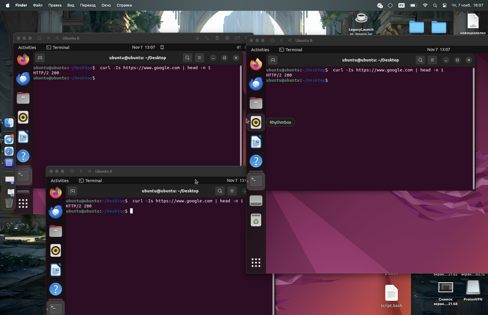
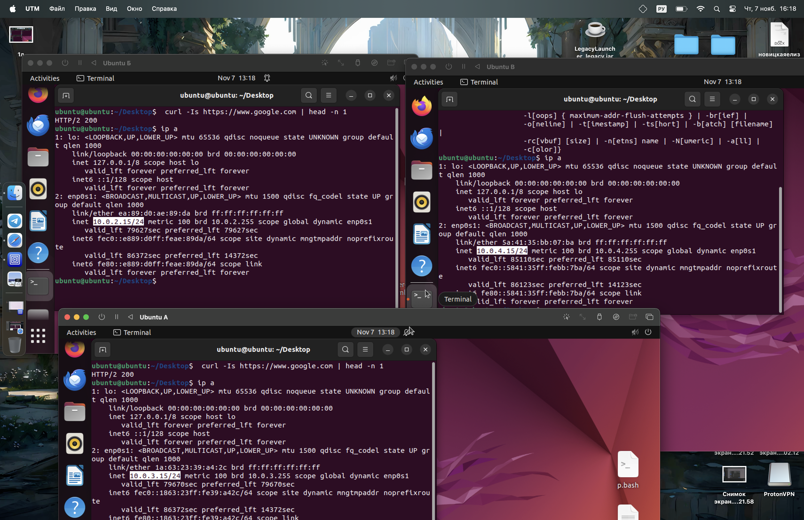
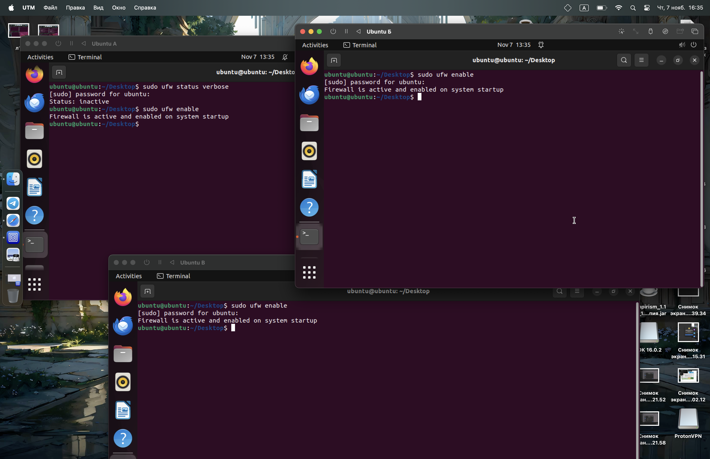
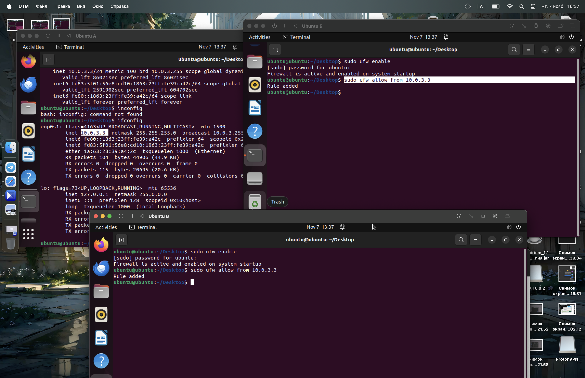
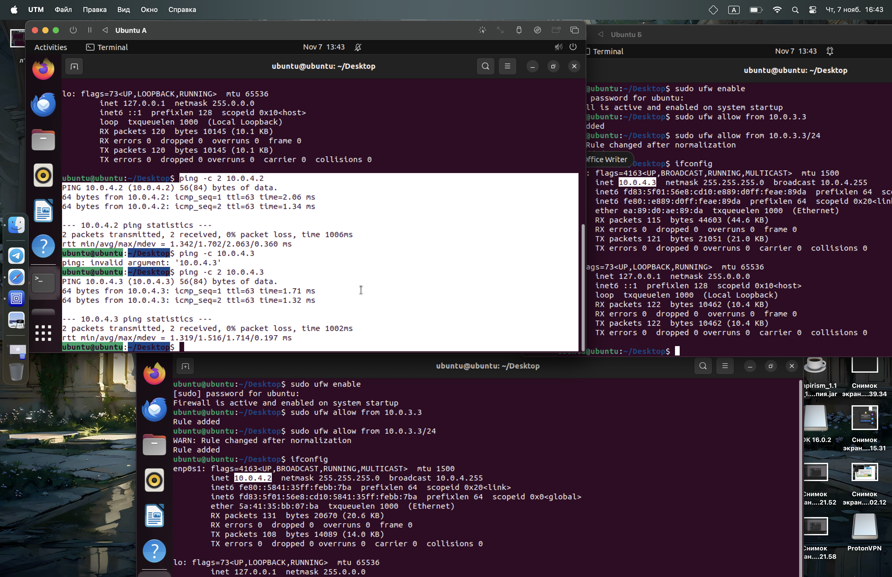

# Новицкая Елизавета Лабораторная №3
1) Я установила ubuntu А, Б, В в UTM
2) В настройках машин я задала параметры общей сети
3) Я проверила подключение к интернету в каждом терминале через команду curl -Is https://www.google.com | head -n 1
curl: Это инструмент командной строки для передачи данных с использованием различных протоколов, включая HTTP и HTTPS.
-I: Этот параметр указывает curl делать только запрос заголовков. Это значит, что он не пытается загрузить содержимое страницы, а только метаданные.
-s: Этот параметр означает "silent", то есть curl не будет выводить прогресс и ошибки. Он просто дает результат выполнения команды.
https://www.google.com: Это URL-адрес, к которому выполняется запрос, домен Google.
head: Это команда, которая выводит первые несколько строк входящих данных. 
-n 1: Этот параметр указывает команде head выводить только первую строку из входящих данных.

    

4) Далее я узнала все IP адреса с помощью команды ip a

    

5) Я установила firewall на все ubuntu и активировала их с помощью команды ufw enable (sudo необходим, так как у меня нет прав root)

    

6) C помощью  ufw allow я разрешила доступ из А в Б и В

    

7) Проверка доступа 

    

8) С помощью ufw deny from я запретила доступ из Б в В

    